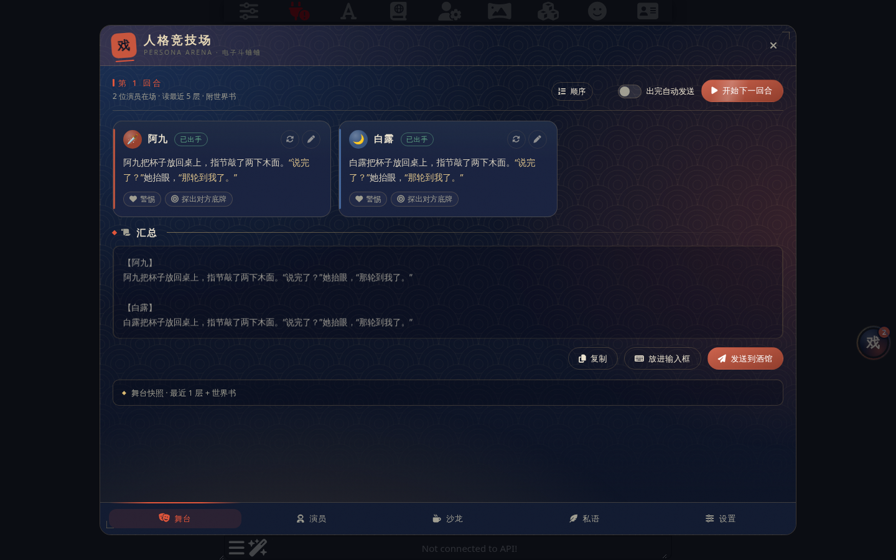
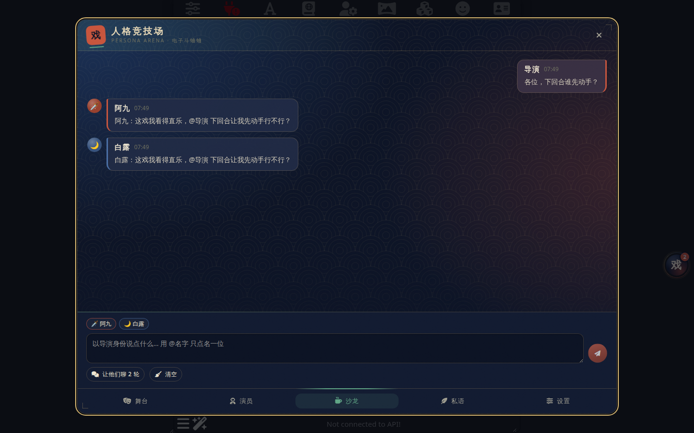
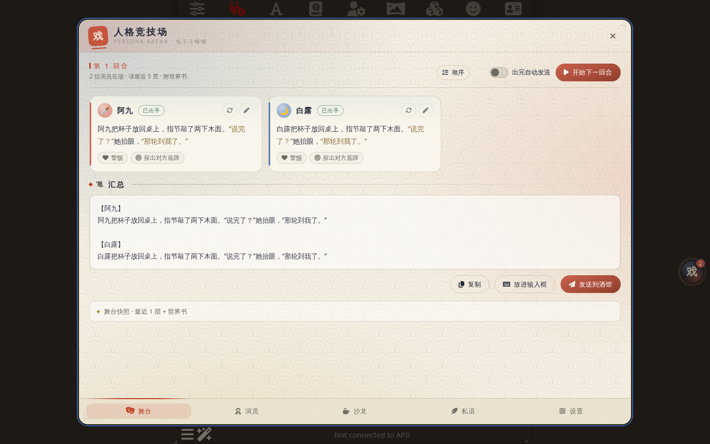

# Persona Arena · 人格竞技场

> 一个 SillyTavern（酒馆）UI 扩展：在你的聊天之外养一队各自独立的 AI 演员，每回合各出一手行动，由你汇总投喂给故事。俗称"电子斗蛐蛐"。



| 沙龙 | 宣纸（浅色） |
|---|---|
|  |  |

## 它能做什么

- **多演员、多接口**：每位演员可以绑定不同的 API 地址、密钥与模型（OpenAI 兼容 / Claude / Gemini / DeepSeek / 酒馆连接配置 / 酒馆当前连接），也可以共用。
- **只出行动，不写叙事**：演员读舞台最近 N 层（默认 5）与**此刻会被触发的世界书**，只输出自己的动作、话语、神态；叙事仍由酒馆里的主 AI 负责。
- **回合制**：你点「开始下一回合」，全员依次（或并行）出手；出完后一键复制、放进输入框或直接发送到酒馆。
- **面板**：每位演员有心情、目标、羁绊（对其他演员或 NPC 的关系分值）、经历簿，全部由演员自己在行动中更新，也可手改。
- **沙龙**：故事外的大群，演员以"演员本人"口吻聊天、吐槽、商量下一步；可以让他们自己聊几轮。
- **私语与指令**：私聊某位演员下指令；TA 会根据性格、底线和关系**接受 / 拒绝 / 讲条件**。让 TA 去刺杀自己最重要的人？大概率会被拒。
- **人设工坊**：内置 10 个性格预设；可从酒馆角色卡导入、从舞台提炼 NPC、或填"来源作品 + 人物"联网搜索后一键生成同人角色（魂穿 / 身穿）。
- **入口**：可拖拽吸边的悬浮球、魔棒扩展菜单项、`/arena` 与 `/arena-round` 斜杠命令。
- **两套主题**：夜帖（深色）、宣纸（浅色），「浮世靛朱金」配色——靛青定调、朱砂点睛、藤黄／松绿／胭脂做各页题签、金泥线做裱边；桌面为浮窗，手机为全屏抽屉；遵守酒馆的减少动效 / 关闭模糊 / 去阴影设置，不依赖任何外网资源。

## 安装

酒馆 → 扩展 → 安装扩展 → 粘贴仓库地址：

```
https://github.com/1798547983tt/Persona-Arena
```

要求 SillyTavern ≥ 1.13。安装后右下角会出现一个写着「戏」的悬浮球。

## 三分钟上手

1. 打开悬浮球 → **设置** → 连接。默认已有一条「酒馆当前连接」，直接用你此刻连着的 API 即可；想给不同演员配不同接口就「新增连接」。
2. **演员** → 新演员：起名、选性格预设、选连接，或者用工坊一键生成。启用两位以上更热闹。
3. 回到酒馆聊天，正常玩到某个节点，然后打开 **舞台** → **开始下一回合**。
4. 看每位演员的行动，不满意可单独重生成或手改，然后 **发送到酒馆**（作为你的发言进入故事，主 AI 会接着写）。
5. 想暗中操作就去 **私语**；想听他们吵架就去 **沙龙**。

## 密钥放在哪

默认写入酒馆服务端的密钥库（和酒馆自己的 API Key 同一处），插件设置里只记一个引用 ID，导出文件不含密钥。只有 Claude / Gemini 使用**非官方地址**时，酒馆后端要求明文代理密码，此时插件会提示并改为明文保存。细节见 [docs/adr/0003](docs/adr/0003-api-keys-live-in-sillytavern-secret-store.md)。

## 联网搜索

所有搜索经酒馆后端发出，不受浏览器跨域限制。来源按优先级：Tavily（在设置页存入密钥）→ Serper → 自建 SearXNG → DuckDuckGo（免密钥）。

## 数据存放

| 内容 | 位置 |
|---|---|
| 演员、连接、偏好 | `extension_settings['persona-arena']`（随酒馆设置） |
| 回合、面板、沙龙、私语 | 当前聊天的 `chat_metadata['persona-arena']`（随聊天文件；分支会复制） |
| 悬浮球位置 | 浏览器 `localStorage` |

## 目录

```
manifest.json         扩展清单
index.js              入口：悬浮球、面板、魔棒项、斜杠命令
style.css             主题「夜帖」「宣纸」与全部动效
src/
  settings.js         全局设置
  state.js            每聊天运行态
  connections.js      连接 → 酒馆后端请求、密钥库、模型列表
  llm.js              生成与 <move>/<state> 等标签解析
  prompts.js          性格预设、行动/沙龙/私语/人设生成提示词
  stage.js            读楼层、干跑世界书、发送到酒馆
  rounds.js           回合编排与汇总
  social.js           沙龙与私语
  search.js           联网搜索与人设生成
  ui/                 悬浮球、面板外壳、五个页签、motion.js（动效标记钩子）
docs/
  design/grill-session.md   设计树（grill-with-docs 记录）
  adr/                      架构决策记录
CONTEXT.md            术语表
STDB/                 酒馆开发知识库（参考资料）
```

## 已知边界

- 演员的输出格式依赖模型遵从 `<move>` 标签；解析失败时会退回"整段当作行动"，面板更新则可能缺失。
- Claude 没有模型列表端点，只能内置常用列表 + 手填。
- 手机端已适配全屏抽屉，但极窄屏（< 360px）下设置页的部分表格会横向滚动。

## 许可证

MIT
