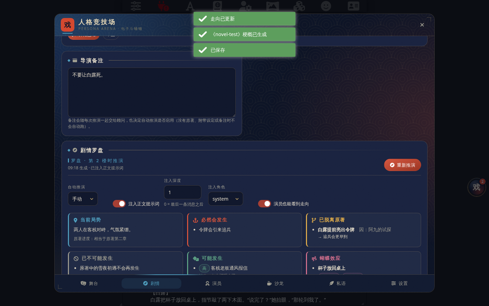
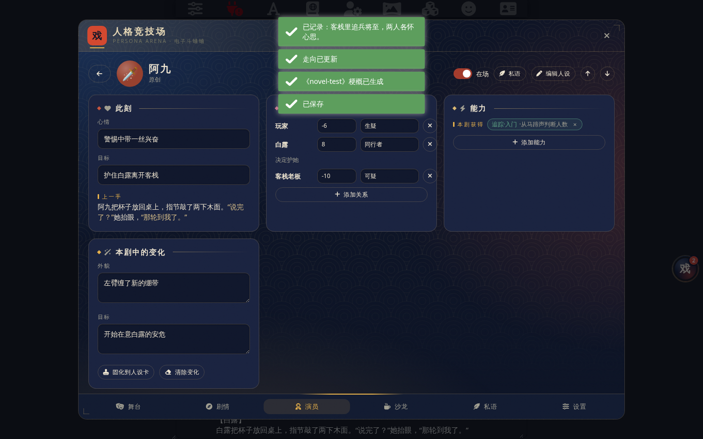

# Persona Arena · 人格竞技场

> 一个 SillyTavern（酒馆）UI 扩展：在你的聊天之外养一队各自独立的 AI 演员，每回合各出一手行动，由你汇总投喂给故事。俗称"电子斗蛐蛐"。


| 剧情罗盘 | 史官更新后的演员 |
|---|---|
|  |  |

| 沙龙 | 宣纸（浅色） |
|---|---|
|  |  |

## 它能做什么

- **多演员、多接口**：每位演员可以绑定不同的 API 地址、密钥与模型（OpenAI 兼容 / Claude / Gemini / DeepSeek / 酒馆连接配置 / 酒馆当前连接），也可以共用。
- **按聊天隔离**：演员、面板、回合、沙龙、私语、罗盘、史官日志都只属于"某张角色卡的某个聊天"，不同聊天互不干扰；全局只有一个**演员库**存模板，任何聊天都能一键邀请。
- **只出行动，不写叙事**：演员读舞台最近 N 层（默认 5）与**此刻会被触发的世界书**，只输出自己的动作、话语、神态；叙事仍由酒馆里的主 AI 负责。
- **回合制**：你点「开始下一回合」，全员依次（或并行）出手；出完后一键复制、放进输入框或直接发送到酒馆。
- **面板**：每位演员有心情、目标、羁绊（对其他演员或 NPC 的关系分值）、经历簿，全部由演员自己在行动中更新，也可手改。
- **沙龙**：故事外的大群，演员以"演员本人"口吻聊天、吐槽、商量下一步；可以让他们自己聊几轮。
- **私语与指令**：私聊某位演员下指令；TA 会根据性格、底线和关系**接受 / 拒绝 / 讲条件**。让 TA 去刺杀自己最重要的人？大概率会被拒。
- **人设工坊**：内置 10 个性格预设；可从酒馆角色卡导入、从舞台提炼 NPC、或填"来源作品 + 人物"联网搜索后一键生成同人角色（魂穿 / 身穿）。
- **剧情罗盘（同人向）**：原著四种来源——按作品名生成（凭模型知识，可联网补资料）、从世界书选条目、导入 TXT 小说（逐段提要再汇总）、手写梗概。剧情顾问读原著、最近 N 层正文、世界书与导演备注，推演：当前局势与原著进度、什么必然发生、什么已脱离原著、什么已不可能、什么可能、蝴蝶效应、**原著接下来本该发生的事（如期/提前/推迟/已不可能/已变形）**、**OOC 提醒**、接下来的节拍与给正文的引导。引导自动注入正文提示词（可设深度/角色、可手改），可每 N 层自动更新，演员出手时也能看到走向。
- **从原著提炼演员**：新建演员时可直接从某部原著梗概里提炼一位人物的人设卡（忠于原著的口癖、习惯与底线）。
- **史官（主 AI 动态更新）**：每 N 层正文（默认 3，玩家发言不计数但会一起读，约 6 楼一批）由指定的主 AI 核对每位演员的心情、目标、羁绊、能力得失与人设变化（性格/外貌/经历/口吻/目标），写进本聊天的"本剧中的变化"，附 NPC 名册；有日志、可撤销、可固化进人设卡。
- **破限提示词**：内置你自己预设里的「破限」区条目（尼伯龙根之印 / 夜钟 / 严格誊录协议），开关自选，开启后作为扮演类调用（行动 / 沙龙 / 私语）的最顶端 system 提示；工坊、罗盘、史官这类要求只输出 JSON 的任务默认不带（可在设置里打开），避免破限的"身份不动"指令压过格式要求。也可导入自己的预设 JSON 自动提取「破限」区。
- **入口**：可拖拽吸边的悬浮球、魔棒扩展菜单项、`/arena [stage|plot|actors|salon|whisper|settings]` 与 `/arena-round` 斜杠命令。
- **两套主题**：夜帖（深色）、宣纸（浅色），「浮世靛朱金」配色——靛青定调、朱砂点睛、藤黄／松绿／胭脂做各页题签、金泥线做裱边；桌面为浮窗，手机为全屏抽屉；遵守酒馆的减少动效 / 关闭模糊 / 去阴影设置，不依赖任何外网资源。

## 安装

酒馆 → 扩展 → 安装扩展 → 粘贴仓库地址：

```
https://github.com/1798547983tt/Persona-Arena
```

要求 SillyTavern ≥ 1.13。安装后右下角会出现一个写着「戏」的悬浮球。当前版本 1.0.0。

## 三分钟上手

1. 打开悬浮球 → **设置** → 连接。默认已有一条「酒馆当前连接」，直接用你此刻连着的 API 即可；想给不同演员配不同接口就「新增连接」。
2. **演员** → 新演员：起名、选性格预设、选连接，或者用工坊一键生成。启用两位以上更热闹。
3. 回到酒馆聊天，正常玩到某个节点，然后打开 **舞台** → **开始下一回合**。
4. 看每位演员的行动，不满意可单独重生成或手改，然后 **发送到酒馆**（作为你的发言进入故事，主 AI 会接着写）。
5. 想暗中操作就去 **私语**；想听他们吵架就去 **沙龙**。
6. **剧情**页：写同人最省事的路径是「按作品名生成」原著梗概（也可从世界书选条目、导入 TXT、手写），写导演备注，点「推演走向」，引导会自动注入正文提示词；设置里开启**史官**后，每出一楼演员数据会自动更新。

## 密钥放在哪

默认写入酒馆服务端的密钥库（和酒馆自己的 API Key 同一处），插件设置里只记一个引用 ID，导出文件不含密钥。只有 Claude / Gemini 使用**非官方地址**时，酒馆后端要求明文代理密码，此时插件会提示并改为明文保存。细节见 [docs/adr/0003](docs/adr/0003-api-keys-live-in-sillytavern-secret-store.md)。

## 联网搜索

所有搜索经酒馆后端发出，不受浏览器跨域限制。来源按优先级：Tavily（在设置页存入密钥）→ Serper → 自建 SearXNG → DuckDuckGo（免密钥）。

## 数据存放

| 内容 | 位置 |
|---|---|
| 连接、偏好、演员库（模板）、原著梗概 | `extension_settings['persona-arena']`（随酒馆设置） |
| 演员、面板、回合、沙龙、私语、罗盘、史官日志、NPC 名册 | 当前聊天的 `chat_metadata['persona-arena']`（随聊天文件；分支会复制） |
| 原著梗概 | `extension_settings['persona-arena'].canons`；TXT 原文另存浏览器 IndexedDB |
| 罗盘注入 | `setExtensionPrompt('PERSONA_ARENA_PLOT', …)`，切聊天时自动重设 |
| 悬浮球位置 | 浏览器 `localStorage` |

## 目录

```
manifest.json         扩展清单
index.js              入口：悬浮球、面板、魔棒项、斜杠命令
style.css             主题「夜帖」「宣纸」与全部动效
src/
  settings.js         全局设置
  state.js            每聊天运行态
  connections.js      连接 → 酒馆后端请求、密钥库、模型列表
  llm.js              生成与 <move>/<state> 等标签解析
  prompts.js          性格预设、行动/沙龙/私语/人设生成提示词
  stage.js            读楼层、干跑世界书、发送到酒馆
  rounds.js           回合编排与汇总
  social.js           沙龙与私语
  search.js           联网搜索与人设生成
  plot.js             剧情罗盘：原著摘要、走向推演、注入
  chronicler.js       史官：每楼更新演员数据、日志、撤销、固化
  jailbreak.js        破限提示词：提取、开关、拼接
  data/               内置的破限条目（从 2609010.json 提取）
  ui/                 悬浮球、面板外壳、六个页签、motion.js（动效标记钩子）
docs/
  design/grill-session.md   设计树（grill-with-docs 记录）
  adr/                      架构决策记录
CONTEXT.md            术语表
STDB/                 酒馆开发知识库（参考资料）
```

## 已知边界

- 演员的输出格式依赖模型遵从 `<move>` 标签；解析失败时会退回"整段当作行动"，面板更新则可能缺失。
- 人设生成、原著梗概、罗盘、史官等 JSON 任务：解析器会在模型夹带的状态栏、草稿、代码块、说明文字里找出括号平衡且字段匹配的对象；仍失败时自动把错误输出回传并要求只输出 JSON 重试一次，两次都失败才报错并显示模型返回的开头，便于排查。
- Claude 没有模型列表端点，只能内置常用列表 + 手填。
- 世界书列表优先用酒馆上下文接口，旧版酒馆没有该接口时回退到编辑器下拉框与服务器接口；列表为空时点「刷新」。
- 手机端已适配全屏抽屉，但极窄屏（< 360px）下设置页的部分表格会横向滚动。
- 长篇 TXT 总结按约 6000 字一段逐段提要，百万字约 170 次调用；请用便宜的大上下文模型，中途可中止。
- 史官按酒馆渲染出新楼的事件计数；重生成/滑动同一楼不会重复计数，但会把最新内容一起读进下一批；每次记录可撤销。
- 旧版本（演员全局共享）升级后：某个聊天里有过面板记录的演员会自动从演员库复制进该聊天，其余聊天需从演员库邀请。

## 许可证

MIT
